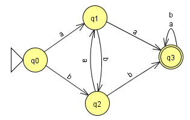

# AFD Exercício 4

Implementação java recursivo de um Autômato Finito Determinístico(AFD) que reconhece a linguagem:

L = {w &isin; {a,b}* | w possui aa ou bb como subpalavra}
- Ex.: aa, bb, aaaa, abbb, bbba, aabba, .... 

Definição da linguagem:
- L = <{a, b}, {s0, s1, s2, s3}, s0, δ, {s3}>, 
- onde δ é:
    - δ{s0,a) = s1 	
	- δ{s1,a) = s3
	- δ{s1,b) = s2	
    - δ{s0,b) = s2
	- δ{s1,b) = s3
	- δ{s1,a) = s1	
    - δ{s3,a) = s3	
	- δ{s3,b) = s3	
	
AFD:

Arquivo JFlap:
[AFD_ex4_v1.jff](AFD_ex4_v1.jff)